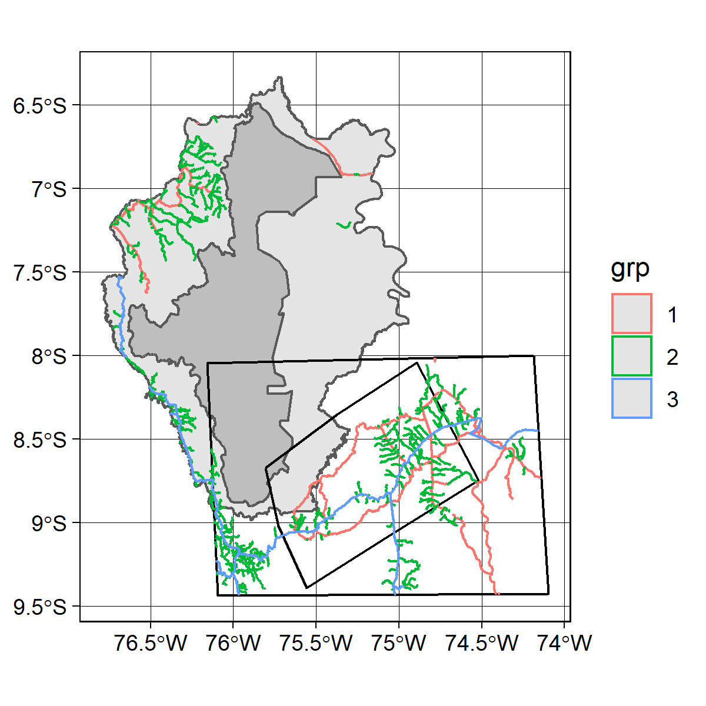

```{r setup, include=FALSE}
knitr::opts_chunk$set(echo = TRUE)
```

## Data

Read in roads (package data) and GEDI data
```{r, message=FALSE, warning=FALSE}
library(gediamazonia)
library(ggplot2)
library(dplyr)
library(sf)
```

```{r, eval=FALSE}
data(roads)
data(studyarea)

gedi2a <- dir("external/data/2a/", pattern = "shp", full.names = TRUE) %>% 
  lapply(., function(x) st_read(x) %>% mutate(id = as.character(1:nrow(.))))

gedi2b <- dir("external/data/2b/", pattern = "shp", full.names = TRUE) %>% 
  lapply(., function(x) st_read(x) %>% mutate(id = as.character(1:nrow(.))))

p <- ggplot() + geom_sf(data = studyarea$np, fill = "grey") + 
  geom_sf(data = studyarea$buffer, fill = "grey90") + 
  geom_sf(data = studyarea$cacao_zone, color = "black", fill = "transparent") +
  geom_sf(data = studyarea$aoi, color = "black", fill = "transparent") +
  geom_sf(data = roads, aes(color = grp)) + 
  geom_sf(data = gedi2a[[1]], pch = 16, size = 0.01, col = "yellow") + 
  theme_linedraw()
ggsave(p, filename = here::here("external/notebooks/aoi_roads.png"), height = 4,
       width = 4, dpi = 300)
# png(filename = here::here("external/notebooks/aoi_roads.png"), height = 4,
#     width = 4, res = 300, units = "in")
# p
# dev.off()
```
```{r, echo=FALSE, fig.align="center", out.width="80%"}

```


## Clean roads

Select just roads type 1 and 3, union them, and crop to the AOI.
```{r, eval=FALSE}
roads_uni <- roads %>% st_union()  
```


## Process GEDI data

Create a dataset that finds closest point for each observation to road, and use that to find distance to nearest road.
```{r, eval=FALSE}
library(doMC)

# select distance to roads
gedi_key <- gedi2a[[1]] %>% select(id)  # assumes all points in dataset are same
roads_dist <- gedi_key %>% mutate(roads_dist = st_distance(., roadscr))

# set up row groupings for parallelizing
blocks <- c(round(seq(1, nrow(gedi_key), nrow(gedi_key) / 8)), nrow(gedi_key))
blocks <- cbind(blocks[-length(blocks)], blocks[-1])

# parallelize in 8 chunks
registerDoMC(8)
system.time(
  gedi_rdist <- foreach(i = 1:nrow(blocks), .combine = "rbind") %dopar% {
    ind <- blocks[i, ]
    gedi_block <- gedi_key %>% slice(ind[1]:ind[2])
    gedi_dist <- gedi_block %>% mutate(roaddist = st_distance(., roads_uni))
  }
)
# usethis::use_data(gedi_rdist)
#     user   system  elapsed 
# 9064.159   13.257 1175.639
```

## Get GEDI metrics by key

Use the ID key in `gedi_rdist` 
```{r, eval=FALSE}
data("gedi_rdist")

# pull out subsets
elev <- gedi2a[[1]] %>% as_tibble %>% dplyr::select(id, elvtn_0)
rh_2a <- gedi2a[[2]] %>% as_tibble %>% 
  dplyr::select(id, rh0, rh25, rh50, rh75, rh100)
pz1 <- gedi2b[[1]] %>% as_tibble %>%
  dplyr::select(id, p_z0_5m, p_z5_10, p_10_15, p_15_20)
pz2 <- gedi2b[[2]] %>% as_tibble %>%
  dplyr::select(id, pvd_0_5, pv_5_10, p_10_15, p_15_20) %>% 
  rename(pv_10_15 = p_10_15, pv_15_20 = p_15_20)

# join
gedi_ss <- left_join(gedi_rdist, elev) %>% 
  left_join(., rh_2a) %>% 
  left_join(., pz1) %>% 
  left_join(., pz2)

# distnace class
gedi_ss <- gedi_ss %>% mutate(distclass = case_when(
  between(roaddist, 0, 1000) ~ "1",
  between(roaddist, 1000, 2000) ~ "2",
  between(roaddist, 2000, 3000) ~ "3",
  between(roaddist, 3000, 4000) ~ "4",
  between(roaddist, 4000, 5000) ~ "5",
  roaddist > 5000 ~ "6")
)
# usethis::use_data(gedi_ss)
```

## Plot

```{r, fig.align="center", fig.cap="Average RH100 by distance class"}
# plot
gedi_ss %>% dplyr::filter(rh100 > 0) %>% 
  dplyr::filter(between(elvtn_0, 2000, 4500)) %>% 
  as_tibble %>% group_by(distclass) %>%  
  summarize(elev = mean(elvtn_0), rh100 = mean(rh100)) %>% 
  ggplot() + geom_point(aes(distclass, rh100))
```

```{r, fig.align="center", fig.cap="RH100 distribution by distance class"}
# plot
gedi_ss %>% dplyr::filter(rh100 > 0) %>% 
  dplyr::filter(between(elvtn_0, 2000, 4500)) %>% 
  as_tibble %>% group_by(distclass) %>% 
  ggplot() + geom_boxplot(aes(x = distclass, y = rh100))
```
```{r, fig.align="center", fig.cap="Elevation distribution by distance class"}
gedi_ss %>% dplyr::filter(rh100 > 0) %>% 
  dplyr::filter(between(elvtn_0, 2000, 4500)) %>% 
  as_tibble %>% group_by(distclass) %>% 
  ggplot() + geom_boxplot(aes(x = distclass, y = elvtn_0))
```

